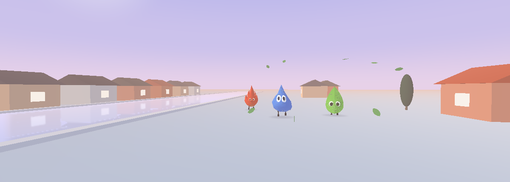

# Elemental Rescue

A playful 3D **rescue adventure** built in [Godot 4.6](https://godotengine.org/),
set in a twilight town of rock‑paper‑scissors elementals. Your twin is locked in
a zoo cage: find your key, free them, and walk them home to your cave — while your
rival element and roaming CO₂ try to send you back to the start.



*An actual in‑engine frame — Fire, Water and Leaf strolling the riverbank at dusk.*

## Meet the characters

| | Element | Catches | Flees |
|---|---------|---------|-------|
| 🔥 | **Fire** | Leaf | Water |
| 💧 | **Water** | Fire | Leaf |
| 🍃 | **Leaf** | Water | Fire |

Each character is a textured GLB body with a hand‑rigged pair of stick legs that
swing when walking and stand still when idle.

## How to play

The goal is to **rescue your caged twin** — there is no clock and you can't be
permanently knocked out, so take your time:

1. **Find your key.** Each element has its own **silvery, colour‑matched key**
   (silvery‑red Fire, silvery‑blue Water, silvery‑green Leaf) — and you can only
   pick up **your own**. It waits deep in your **predator's territory** — out among
   their cave, clan hall and training pad — so claiming it means a raid into the turf
   of the element that hunts you. Yours is marked in your element's colour on the
   radar; walk over it and it magnets to your back and trails you.
2. **Free your twin.** Carry the key to *your* element's cage in the zoo and your
   twin pops out and starts following you.
3. **Escort them home.** Lead your twin into your home cave to **win**. If you die
   mid‑escort they'll wait where they are until you come back.

Along the way:

- **Hearts, not lives.** A touch from your predator (the element that beats you) or
  from CO₂ costs **one heart**. At zero hearts you're sent back to your home cave,
  refilled — never eliminated.
- **CO₂ chemistry.** A CO₂ is a carbon with two oxygens. When one **tags you it spends
  an oxygen** and drops to harmless **CO** (it visibly loses an oxygen and greys out on
  the radar). A grey CO can't hurt you — it roams hunting an **O₂ to grab an oxygen** and
  turn back into dangerous CO₂ (or it recharges on its own after a while). O₂ molecules
  respawn, so there's always oxygen in play.
- **Counter‑slow.** Whoever lands a hit on you *or* a clan member is slowed for 5s —
  your window to get away.
- **Self‑training.** Stand on the glowing **totem** beside your cave (with no enemy
  near) to earn an **extra heart**, up to four. Training is kept even after you're
  sent home.
- **Clan hall.** Stand in your **clan hall** for ~4s to summon a **clan of 10** of
  your own element. The moment they appear the camera lifts into a **top‑down command
  view** (looking down through the see‑through roof) and they gather under it. **Click**
  members to select them (multi‑select — they turn grey), then pick one of three tasks
  from the buttons at the top of the screen (the icons are little renders of the real
  figures). Once every member is assigned (or you walk off), the camera returns to normal:
  - **Protect me** — hunt down your predator and any black CO₂ that threatens you.
  - **Attack** — chase and tag the element you eat.
  - **Fetch key** — find your key and carry it back to you.

  Re‑select any time to re‑assign. (Left‑click selects; left‑*drag* still looks around.)
- **Sip O₂ for sprint.** You don't *need* oxygen to survive — but each white **O₂**
  you walk over **supercharges your sprint**: a bigger effective stamina tank (drains
  slower, refills faster) plus an instant gulp. You're now racing the grey CO for the
  same molecules — the bar stays the same size, it just lasts longer.
- **River & bridges.** The river slows every element except Water; cross on the
  three bridges.
- **Black stones (Pac‑Man power‑up).** Scattered dark stones (shown on the radar)
  turn you into an **energized black figure** for 15s and run a little faster. While
  disguised the tables turn: your **predator panics and flees, and you can eat it**
  on contact, and the CO₂ treat you as one of their own. The catch — the **O₂ see
  through it and hunt you**, and a bite ends the disguise and costs a heart. Each
  stone reappears elsewhere a while after it's used.

The rival elements, CO₂ and O₂ all run a **context‑steering brain**: chasers aim at
where you're *going* (not where you are) to cut you off, fleers slip toward open
ground instead of trapping themselves in a corner, and the CO₂ pack spreads out to
cover more of the map.

## Controls

| Action | Input |
|--------|-------|
| Move | `W` `A` `S` `D` or arrow keys |
| Sprint | hold `Shift` (drains stamina) |
| Look around | drag with the **left mouse button** |

## Running it

Open the project folder in **Godot 4.6+** and press play, or from the command line:

```sh
godot --path .
```

To jump straight into a round (skipping the menu) for quick testing:

```sh
godot --path . -- autostart           # play as Fire
godot --path . -- autostart water     # play as Water
godot --path . -- autostart grass     # play as Leaf
```

## Under the hood

The code lives in `src/`, the scenes in `scenes/` (`main.tscn` is the entry
point), and the imported art in `models/`; `project.godot` and `icon.svg` stay at
the project root where Godot expects them.

Everything except the three elemental bodies is built procedurally in code
(`src/mesh_lib.gd`) — houses, props, the gas molecules, caves and the storybook
materials — so the project stays self‑contained. The fire/water/leaf bodies are
imported GLB meshes (`models/Fire3.glb`, `models/Water3.glb`, `models/Leaf3.glb`); their legs are
generated at load time and auto‑seated into each body so they always connect
cleanly regardless of body shape.

Key scripts (under `src/`):

- `game.gd` — the main game loop, AI, caves, river, scoring and camera.
- `game_char.gd` — per-actor state (the `GameChar` class: position, hearts, role).
- `mesh_lib.gd` — procedural mesh/material factory and the character builders.
- `char_visual.gd` — the walking rig (body bob + leg/arm swing).
- `world_builder.gd` — lays out the town, caves and river.
- `ui.gd` / `radar.gd` — HUD, scoreboard and minimap.

It began life as a Three.js prototype (`elemental-tag.html`) and was ported to
Godot.
