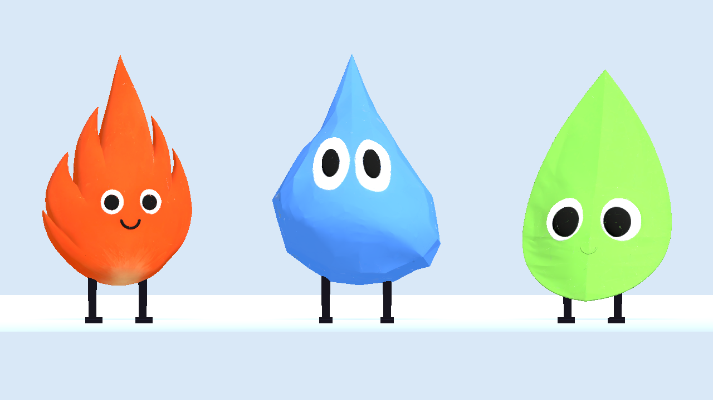

# Elemental Tag

A playful 3D game of **rock‑paper‑scissors tag** built in [Godot 4.6](https://godotengine.org/).
Three little elementals chase each other across a twilight town while CO₂ hunts
everyone and O₂ molecules hand out points. Whoever has the most points when the
clock runs out wins.



## Meet the characters

| | Element | Catches | Flees |
|---|---------|---------|-------|
| 🔥 | **Fire** | Leaf | Water |
| 💧 | **Water** | Fire | Leaf |
| 🍃 | **Leaf** | Water | Fire |

Each character is a textured GLB body with a hand‑rigged pair of stick legs that
swing when walking and stand still when idle.

## How to play

- **Pick an element** from the menu, then survive a 4‑minute round (240s).
- **Catch your prey** — touch the element you beat for **+15 points**.
- **Flee your predator** — get tagged by the element that beats you and you're out.
- **Collect O₂ molecules** scattered around the map for **+5 points** each.
- **Dodge CO₂** — these dark molecules hunt every element on sight.
- **Duck into your home cave** to be safe, but you can only hide there for 30s at
  a time before you're booted back out.
- Cross the **river** using the bridges — the elements move at different speeds on
  different terrain.

Most points when time runs out takes the win.

## Controls

| Action | Input |
|--------|-------|
| Move | `W` `A` `S` `D` or arrow keys |
| Sprint | hold `Shift` (drains stamina) |
| Look around | drag with the **left mouse button** |

## Running it

Open the project folder in **Godot 4.6+** and press play, or from the command line:

```sh
godot --path .
```

To jump straight into a round (skipping the menu) for quick testing:

```sh
godot --path . -- autostart           # play as Fire
godot --path . -- autostart water     # play as Water
godot --path . -- autostart grass     # play as Leaf
```

## Under the hood

Everything except the three elemental bodies is built procedurally in code
(`mesh_lib.gd`) — houses, props, the gas molecules, caves and the storybook
materials — so the project stays self‑contained. The fire/water/leaf bodies are
imported GLB meshes (`Fire3.glb`, `Water3.glb`, `Leaf3.glb`); their legs are
generated at load time and auto‑seated into each body so they always connect
cleanly regardless of body shape.

Key scripts:

- `game.gd` — the main game loop, AI, caves, river, scoring and camera.
- `mesh_lib.gd` — procedural mesh/material factory and the character builders.
- `char_visual.gd` — the walking rig (body bob + leg/arm swing).
- `world_builder.gd` — lays out the town, caves and river.
- `ui.gd` / `radar.gd` — HUD, scoreboard and minimap.

It began life as a Three.js prototype (`elemental-tag.html`) and was ported to
Godot.
